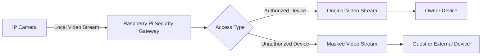
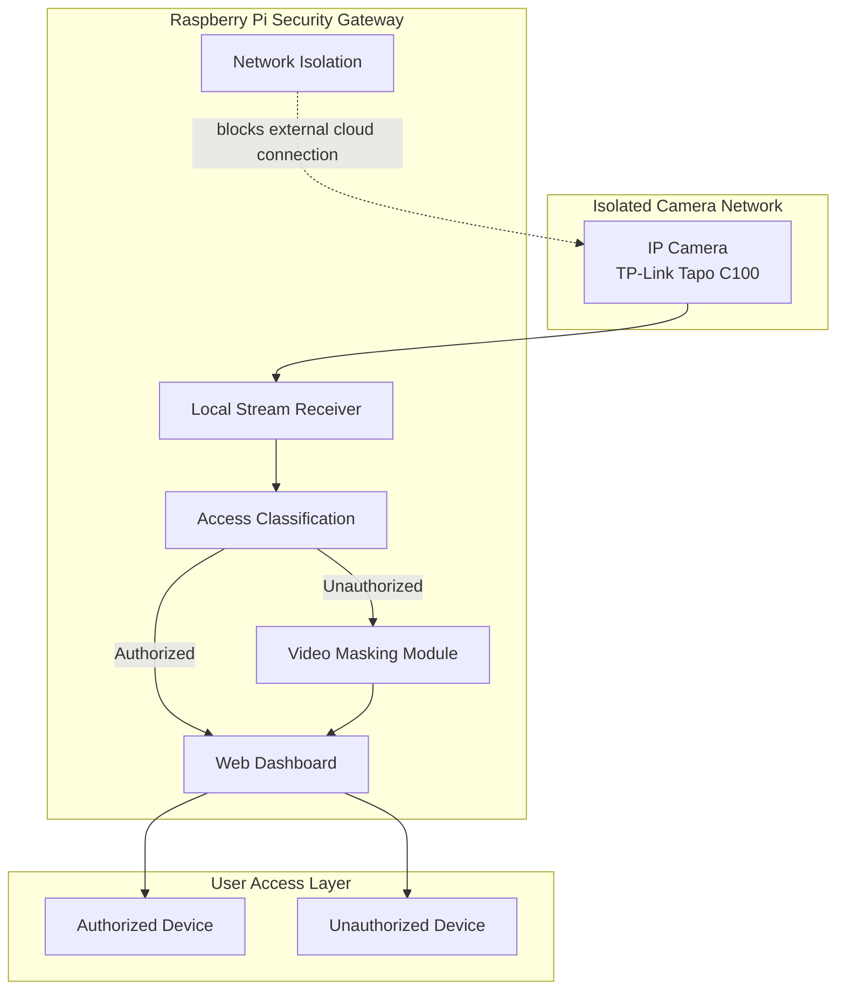
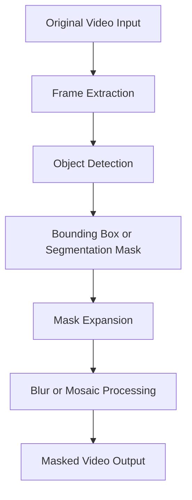
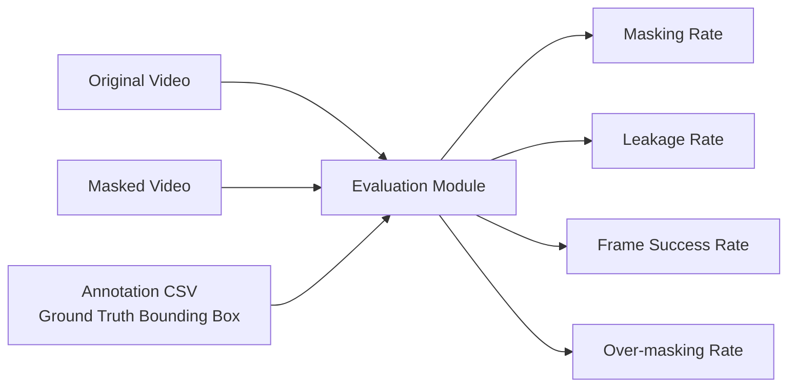
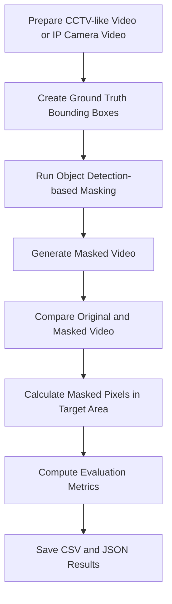

# IP 카메라 영상 유출 방지를 위한 보안 게이트웨이 구현

> Raspberry Pi 기반 보안 게이트웨이와 영상 마스킹 처리를 활용한 IP 카메라 프라이버시 보호 시스템


---

## 프로젝트 개요

최근 가정용 IP 카메라와 월패드가 해킹되어 개인의 사생활 영상이 외부로 유출되는 사례가 지속적으로 발생하고 있다. 특히 저가형 IoT 기기는 제조 단계의 보안 취약점, 백도어 가능성, 미흡한 펌웨어 업데이트 지원 등으로 인해 사용자의 비밀번호 관리만으로는 영상 유출 위험을 완전히 차단하기 어렵다.

본 프로젝트는 IP 카메라가 외부 클라우드 서버와 직접 통신하는 구조를 개선하고, 모든 영상 스트림을 **Raspberry Pi 기반 보안 게이트웨이**를 통해 제어하는 것을 목표로 한다.

또한 비인가 접속 상황에서는 원본 영상이 아닌 **마스킹 처리된 영상**만 제공하여, 영상이 외부로 유출되더라도 개인 식별 정보가 노출되지 않도록 하는 보안 구조를 구현한다.

---

## 연구 목적

본 프로젝트의 주요 목적은 다음과 같다.

1. IP 카메라의 외부 클라우드 직접 통신 차단
2. Raspberry Pi 기반 로컬 보안 게이트웨이 구현
3. 인가 기기와 비인가 기기를 구분하는 투트랙 접속 로직 설계
4. 비인가 접속 시 객체 탐지 기반 영상 마스킹 처리
5. 마스킹 처리율, 누출률, 프레임 성공률 등을 활용한 성능 평가

---

## 핵심 아이디어

기존 IP 카메라는 제조사 클라우드 서버와 직접 통신하는 구조가 많다. 이 경우 제조사 서버, 계정 정보, 네트워크 경로 중 하나라도 침해되면 원본 영상이 그대로 노출될 수 있다.

본 프로젝트는 IP 카메라의 영상 스트림을 Raspberry Pi 보안 게이트웨이에서 먼저 수신하고, 접속 기기의 신뢰 여부에 따라 원본 영상 또는 마스킹 영상을 분기 제공한다.



---

## 전체 시스템 구조



---

## 주요 기능

### 1. 망 격리 기반 IP 카메라 보호

IP 카메라가 외부 인터넷 또는 제조사 클라우드 서버와 직접 통신하지 않도록 제한한다. Raspberry Pi를 중간 게이트웨이로 활용하여 영상 스트림을 로컬 환경에서 제어한다.

### 2. 투트랙 접속 로직

접속 기기의 인가 여부에 따라 서로 다른 영상 스트림을 제공한다.

| 접속 유형  | 제공 영상  | 설명                   |
| ------ | ------ | -------------------- |
| 인가 기기  | 원본 영상  | 사용자의 신뢰 기기           |
| 비인가 기기 | 마스킹 영상 | 외부 기기 또는 신뢰할 수 없는 접속 |
| 인증 불완전 | 마스킹 영상 | 원본 노출 방지 우선          |

### 3. 객체 탐지 기반 영상 마스킹

영상 속 사람 또는 민감 영역을 탐지한 뒤, 해당 영역에 블러 또는 모자이크 처리를 적용한다.



### 4. 마스킹 성능 평가

원본 영상, 마스킹 영상, 정답 바운딩 박스를 비교하여 마스킹 성능을 정량적으로 평가한다.



---

## 기술 스택

| 구분               | 사용 기술                           |
| ---------------- | ------------------------------- |
| Language         | Python                          |
| Hardware         | Raspberry Pi, TP-Link Tapo C100 |
| Video Processing | OpenCV                          |
| Object Detection | YOLO                            |
| Data Analysis    | NumPy, Pandas                   |
| Output Format    | CSV, JSON, Video                |
| Version Control  | GitHub                          |

---

## 프로젝트 구조 예시

```text
ip-camera-security-gateway/
│
├── README.md
│
├── src/
│   ├── main.py
│   ├── masking.py
│   ├── evaluation.py
│   ├── gateway.py
│   └── utils.py
│
├── data/
│   ├── sample_video.mp4
│   └── annotations.csv
│
├── output_result/
│   ├── masked_video.avi
│   ├── evaluation_result.csv
│   └── evaluation_summary.json
│
├── docs/
│   ├── research_draft.md
│   ├── system_architecture.png
│   └── experiment_result.md
│
└── requirements.txt
```

---

## 실행 방법

### 1. 저장소 클론

```bash
git clone https://github.com/your-username/ip-camera-security-gateway.git
cd ip-camera-security-gateway
```

### 2. 패키지 설치

```bash
pip install -r requirements.txt
```

### 3. 입력 영상 및 정답 파일 준비

`data/` 폴더 안에 원본 영상과 정답 바운딩 박스 CSV 파일을 넣는다.

```text
data/
├── sample_video.mp4
└── annotations.csv
```

정답 CSV 파일은 다음과 같은 형식을 사용한다.

| frame |  x1 | y1 |  x2 |  y2 | label  |
| ----: | --: | -: | --: | --: | ------ |
|     0 | 120 | 80 | 300 | 420 | person |
|     1 | 125 | 82 | 305 | 425 | person |

### 4. 마스킹 코드 실행

```bash
python src/main.py
```

실행 후 마스킹 영상과 평가 결과가 `output_result/` 폴더에 저장된다.

---

## 성능 평가 지표

본 프로젝트에서는 영상 마스킹 성능을 다음 지표로 평가한다.

### 1. 마스킹 처리율

보호 대상 영역 중 실제로 마스킹된 픽셀의 비율이다.

```text
마스킹 처리율 = 실제 마스킹된 보호 대상 픽셀 수 / 전체 보호 대상 픽셀 수 × 100
```

### 2. 누출률

보호 대상 영역 중 마스킹되지 않고 남아 있는 픽셀의 비율이다.

```text
누출률 = 100 - 마스킹 처리율
```

### 3. 프레임 기준 성공률

각 프레임에서 마스킹 처리율이 기준값 이상인 경우를 성공으로 판단하고, 전체 평가 프레임 중 성공 프레임의 비율을 계산한다.

```text
프레임 기준 성공률 = 성공 프레임 수 / 전체 평가 프레임 수 × 100
```

### 4. 과잉 마스킹률

보호 대상이 아닌 영역까지 불필요하게 마스킹된 비율이다. 과잉 마스킹률이 높으면 영상의 사용성이 떨어질 수 있으므로, 보안성과 사용성의 균형을 함께 고려해야 한다.

---

## 실험 절차



---

## 실험 결과 정리 양식

| 실험 영상   | 평가 프레임 수 | 마스킹 처리율 | 누출률 | 프레임 성공률 | 과잉 마스킹률 |
| ------- | -------: | ------: | --: | ------: | ------: |
| Video 1 |        - |       - |   - |       - |       - |
| Video 2 |        - |       - |   - |       - |       - |
| Video 3 |        - |       - |   - |       - |       - |

---

## 기대 효과

본 프로젝트를 통해 다음과 같은 효과를 기대할 수 있다.

* IP 카메라의 외부 클라우드 의존도 감소
* 사용자가 직접 통제 가능한 로컬 보안 구조 구현
* 비인가 접속 상황에서 원본 영상 유출 위험 감소
* 영상 마스킹을 통한 프라이버시 보호 강화
* 저비용 IoT 환경에서도 적용 가능한 보안 게이트웨이 모델 제안

---

## 한계점 및 개선 방향

현재 프로젝트는 프로토타입 단계이므로 다음과 같은 개선이 필요하다.

* Raspberry Pi 환경에서의 실시간 처리 속도 최적화
* 다양한 조명, 거리, 각도, 움직임 환경에서의 탐지 성능 검증
* 객체 탐지 실패 시 마스킹 누락 문제 개선
* 바운딩 박스 기반 전체 마스킹과 세그멘테이션 마스킹 방식 비교
* 웹 대시보드 인증 방식 강화
* 장시간 스트리밍 환경에서의 안정성 평가

---

## 개발 일정

| 기간 | 주요 내용                  |
| -- | ---------------------- |
| 3월 | 프로젝트 기획 및 필요 물품 선정     |
| 4월 | 프로젝트 계획서 작성 및 관련 기술 탐색 |
| 5월 | 내부 구조 설계 및 프로토타입 제작    |
| 6월 | 모의 방어 테스트 및 결과 보고서 작성  |

---

## 팀 구성

| 역할        | 담당 업무                              |
| --------- | ---------------------------------- |
| 네트워크 설계   | Raspberry Pi 기반 망 격리 및 게이트웨이 구조 설계 |
| 영상 처리     | 객체 탐지 기반 마스킹 처리 및 성능 평가            |
| 인증 시스템 개발 | 인가·비인가 기기 구분 로직 구현                 |
| 프로토타입 제작  | 실제 장비 연결, 테스트 환경 구축 및 시연 준비        |

---

## 논문 초안 목차

```text
1. 서론
   1.1 연구 배경
   1.2 연구 필요성
   1.3 연구 목적
   1.4 연구 범위

2. 관련 연구 및 이론적 배경
   2.1 IP 카메라 보안 위협
   2.2 IoT 보안 게이트웨이
   2.3 영상 비식별화와 마스킹 처리
   2.4 객체 탐지 기반 영상 처리

3. 연구 방법
   3.1 전체 시스템 구성
   3.2 망 격리 구조 설계
   3.3 투트랙 접속 로직
   3.4 영상 마스킹 처리 방법
   3.5 성능 평가 방법

4. 구현
   4.1 개발 환경
   4.2 라즈베리파이 기반 게이트웨이 구현
   4.3 영상 처리 모듈 구현
   4.4 성능 평가 모듈 구현

5. 실험 및 평가
   5.1 실험 목적
   5.2 실험 데이터
   5.3 실험 절차
   5.4 평가 기준

6. 실험 결과
   6.1 마스킹 처리 결과
   6.2 평가 결과 분석
   6.3 문제점 및 개선 방향

7. 논의

8. 결론

참고문헌
부록
```

---

## 프로젝트 진행 상태

| 항목                          | 상태    |
| --------------------------- | ----- |
| 프로젝트 주제 선정                  | 완료    |
| 필요 장비 선정                    | 완료    |
| Raspberry Pi 및 IP 카메라 연결 준비 | 완료    |
| OpenCV 기반 마스킹 코드 작성         | 완료    |
| 마스킹 성능 평가 코드 작성             | 완료    |
| Raspberry Pi 기반 로컬 게이트웨이 구현 | 진행 예정 |
| 실시간 스트림 연동                  | 진행 예정 |
| 인가·비인가 접속 분기 구현             | 진행 예정 |
| 실제 환경 테스트                   | 진행 예정 |
| 논문 초안 작성                    | 진행 중  |
| 최종 결과 보고서 작성                | 진행 예정 |

---

## 참고 자료

* IP 카메라 보안 관련 연구
* IoT 보안 게이트웨이 관련 연구
* 영상 비식별화 및 객체 탐지 기반 마스킹 연구
* OpenCV Documentation
* YOLO Documentation
* Raspberry Pi Documentation

---

## 요약

본 프로젝트는 가정용 IP 카메라 영상 유출 문제를 해결하기 위해 **Raspberry Pi 기반 보안 게이트웨이**와 **객체 탐지 기반 영상 마스킹**을 결합한 방어 중심 시스템을 제안한다.

핵심은 IP 카메라의 외부 직접 통신을 차단하고, 비인가 접속 시 원본 영상이 아닌 마스킹 영상만 제공함으로써 영상 유출 피해를 최소화하는 것이다.
