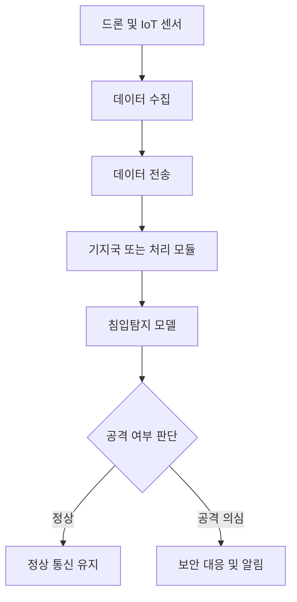
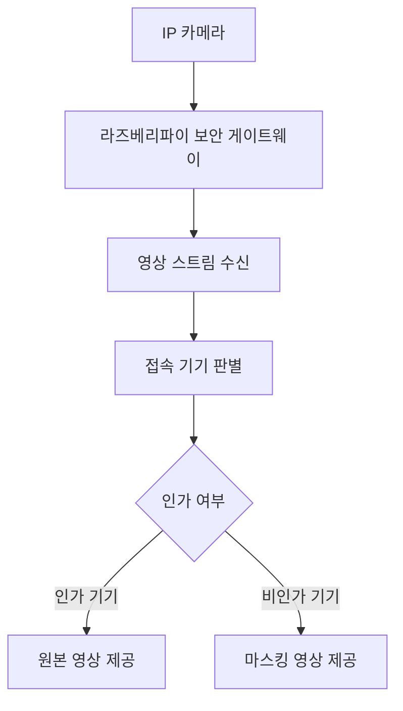

# 관련 논문 정리: IoT 기반 드론 네트워크 침입탐지 보안 프레임워크

> Ashraf, S. N., Manickam, S., Zia, S. S. et al.
> *IoT empowered smart cybersecurity framework for intrusion detection in internet of drones.*
> Scientific Reports, 13, 18422, 2023.

---

## 1. 논문 기본 정보

| 항목      | 내용                                                                                                    |
| ------- | ----------------------------------------------------------------------------------------------------- |
| 논문 제목   | IoT empowered smart cybersecurity framework for intrusion detection in internet of drones             |
| 학술지     | Scientific Reports                                                                                    |
| 출판 연도   | 2023                                                                                                  |
| 연구 분야   | IoT 보안, 드론 네트워크 보안, 침입탐지시스템, 머신러닝, 딥러닝                                                                |
| 주요 기술   | IDS, ML, DL, RNN, LSTM, Bi-LSTM                                                                       |
| 사용 데이터셋 | CICIDS2017, KDDCup99                                                                                  |
| 관련 키워드  | IoT Security, Internet of Drones, Intrusion Detection, Machine Learning, Deep Learning, Cybersecurity |

---

## 2. 논문 선정 이유

본 논문은 드론 네트워크를 대상으로 한 연구이지만, 본 프로젝트의 주제인 **IP 카메라 보안 게이트웨이 구현**과 연결되는 부분이 많다.

IP 카메라와 드론은 모두 네트워크에 연결된 IoT 장비이며, 카메라·센서·무선 통신·데이터 전송 기능을 포함한다. 따라서 다음과 같은 공통 보안 문제가 존재한다.

| 공통 문제          | 설명                            |
| -------------- | ----------------------------- |
| 네트워크 기반 장비     | 외부 네트워크와 연결되어 공격 대상이 될 수 있음   |
| 영상 및 센서 데이터 전송 | 민감한 영상 또는 상태 정보가 외부로 유출될 수 있음 |
| 인증 및 접근 제어 필요  | 비인가 사용자의 접근을 제한해야 함           |
| 데이터 보호 필요      | 전송 중 데이터 탈취, 변조, 도청 위험 존재     |
| 보안 프레임워크 필요    | 단순 비밀번호 관리가 아닌 구조적 보안 설계가 필요함 |

따라서 이 논문은 본 프로젝트에서 다루는 **IoT 장비 보안**, **접근 제어**, **침입탐지**, **데이터 보호**, **보안 프레임워크 설계**의 이론적 배경으로 활용할 수 있다.

---

## 3. 연구 배경

최근 드론, IP 카메라, 스마트 센서, IoT 게이트웨이 등 네트워크 기반 장비의 사용이 증가하면서 다양한 산업 분야에서 실시간 모니터링과 자동화가 가능해지고 있다. 그러나 이러한 IoT 장비들은 무선 통신과 인터넷 연결을 기반으로 동작하기 때문에 보안 위협에 노출되기 쉽다.

논문에서는 특히 드론 네트워크가 다음과 같은 보안 위협에 노출될 수 있다고 설명한다.

* 비인가 접근
* 네트워크 침입
* 데이터 도청
* 데이터 변조
* 장비 탈취
* 물리적 조작
* 서비스 거부 공격
* GPS 스푸핑
* 중간자 공격

이러한 위협은 드론뿐만 아니라 IP 카메라와 같은 영상 기반 IoT 장비에도 유사하게 적용될 수 있다. IP 카메라 역시 외부 서버와 통신하거나 원격 접속 기능을 제공하기 때문에, 네트워크 구조가 안전하지 않으면 영상 유출과 사생활 침해로 이어질 수 있다.

---

## 4. 연구 목적

이 논문의 주요 목적은 IoT 기반 드론 네트워크에서 발생할 수 있는 보안 위협을 탐지하기 위한 스마트 사이버보안 프레임워크를 제안하는 것이다.

구체적인 목적은 다음과 같다.

| 구분   | 내용                                  |
| ---- | ----------------------------------- |
| 목적 1 | 드론 네트워크에서 발생하는 보안 및 프라이버시 문제를 분석한다. |
| 목적 2 | IoT 기반 드론 환경에 적합한 보안 프레임워크를 제안한다.   |
| 목적 3 | 머신러닝 및 딥러닝 기법을 활용하여 네트워크 침입을 탐지한다.  |
| 목적 4 | 침입탐지 모델의 성능을 정량적으로 평가한다.            |
| 목적 5 | 드론 네트워크의 안전한 데이터 통신 구조를 제시한다.       |

---

## 5. 핵심 개념 정리

### 5.1 Internet of Drones

Internet of Drones는 드론이 인터넷 또는 IoT 네트워크에 연결되어 데이터를 수집하고, 전송하고, 분석하는 구조를 의미한다. 드론은 카메라, GPS, 레이더, 고도 센서 등 다양한 센서를 통해 데이터를 수집하고, 이를 지상국 또는 클라우드 시스템으로 전송한다.

이 구조는 감시, 재난 대응, 농업, 산업 관리, 물류, 군사 분야 등에서 활용될 수 있지만, 동시에 네트워크 보안과 개인정보 보호 문제가 발생할 수 있다.

### 5.2 침입탐지시스템

침입탐지시스템은 네트워크 트래픽이나 시스템 동작을 분석하여 비정상적인 행위 또는 공격 가능성을 탐지하는 보안 기술이다.

이 논문에서는 드론 네트워크에서 발생하는 공격을 탐지하기 위해 머신러닝과 딥러닝 기반 침입탐지 방식을 사용한다.

### 5.3 머신러닝과 딥러닝 기반 보안

논문에서는 기존의 규칙 기반 보안 방식만으로는 복잡한 IoT 네트워크 공격을 탐지하기 어렵다고 보고, 머신러닝과 딥러닝 기법을 활용한다.

사용된 주요 모델은 다음과 같다.

| 모델          | 설명                         |
| ----------- | -------------------------- |
| RNN         | 순차 데이터를 처리하는 딥러닝 모델        |
| LSTM        | 장기 의존성을 학습할 수 있는 순환 신경망 모델 |
| Bi-LSTM     | 양방향으로 순차 정보를 학습하는 LSTM 구조  |
| ML 기반 분류 모델 | 정상 트래픽과 공격 트래픽을 분류하는 데 사용  |

---

## 6. 제안 프레임워크

논문에서 제안한 프레임워크는 드론과 지상 기지국이 함께 데이터를 수집하고 분석하는 구조를 가진다. 각 드론은 센서 데이터를 수집하고, 지상국은 네트워크 트래픽과 드론 상태 정보를 분석하여 공격 여부를 판단한다.

프레임워크의 핵심 구성은 다음과 같다.

이 구조는 본 프로젝트의 IP 카메라 보안 게이트웨이 구조와도 유사하게 해석할 수 있다.

즉, 논문에서는 드론 데이터를 보호하기 위해 중간 처리 구조와 침입탐지 모델을 사용하고, 본 프로젝트에서는 IP 카메라 영상을 보호하기 위해 라즈베리파이 기반 게이트웨이와 마스킹 처리를 사용한다는 차이가 있다.

---

## 7. 실험 방법

논문에서는 제안한 보안 프레임워크의 성능을 평가하기 위해 공개 침입탐지 데이터셋을 사용하였다. 주요 데이터셋은 CICIDS2017과 KDDCup99이다.

성능 평가는 다음 지표를 활용하였다.

| 평가 지표     | 의미                       |
| --------- | ------------------------ |
| Accuracy  | 전체 데이터 중 모델이 올바르게 분류한 비율 |
| Precision | 공격으로 예측한 것 중 실제 공격인 비율   |
| Recall    | 실제 공격 중 모델이 공격으로 탐지한 비율  |
| F1-score  | Precision과 Recall의 조화 평균 |

이러한 지표들은 보안 모델이 단순히 많이 맞히는지를 넘어서, 실제 공격을 얼마나 잘 탐지하고 오탐을 얼마나 줄이는지를 함께 확인하는 데 사용된다.

---

## 8. 주요 결과

논문에서는 LSTM과 Bi-LSTM 기반 모델이 드론 네트워크의 침입탐지에서 우수한 성능을 보였다고 보고한다.

주요 결과는 다음과 같이 정리할 수 있다.

| 항목       | 내용                                                |
| -------- | ------------------------------------------------- |
| 성능 평가 방식 | Accuracy, Precision, Recall, F1-score             |
| 사용 모델    | RNN, LSTM, Bi-LSTM 등                              |
| 주요 결과    | 딥러닝 기반 모델이 전통적 머신러닝 방식보다 우수한 탐지 성능을 보임            |
| 연구 의의    | IoT 기반 드론 네트워크에서도 ML/DL 기반 침입탐지 구조가 효과적일 수 있음을 제시 |

논문에서 제시한 대표 성능은 다음과 같다.

| 지표        |    논문에서 제시한 성능 범위 |
| --------- | ----------------: |
| Precision | 약 89.10% ~ 90.16% |
| Accuracy  | 약 91.00% ~ 91.36% |
| Recall    | 약 81.13% ~ 90.11% |
| F-measure | 약 88.11% ~ 90.19% |

---

## 9. 본 프로젝트와의 관련성

본 논문은 드론 네트워크를 대상으로 하지만, 본 프로젝트의 IP 카메라 보안 구조 설계에 다음과 같은 시사점을 제공한다.

### 9.1 IoT 장비는 네트워크 구조 자체가 보안의 핵심이다

논문은 IoT 드론이 단순한 장비가 아니라 네트워크에 연결된 시스템이기 때문에, 데이터 전송 구조와 접근 제어가 중요하다고 설명한다. 이는 IP 카메라도 마찬가지이다.

본 프로젝트에서는 IP 카메라가 외부 클라우드 서버와 직접 통신하지 않도록 제한하고, 라즈베리파이 보안 게이트웨이를 통해 영상 스트림을 제어한다. 이는 네트워크 구조 자체를 보안 관점에서 재설계하는 방식이다.

### 9.2 인증과 접근 제어가 필수적이다

논문에서는 인증, 접근 제어, 권한 관리가 IoT 보안의 핵심 요소라고 설명한다. 본 프로젝트에서도 인가 기기와 비인가 기기를 구분하여 서로 다른 영상을 제공하는 투트랙 접속 로직을 사용한다.

| 논문                     | 본 프로젝트                       |
| ---------------------- | ---------------------------- |
| 드론 및 기지국 사이의 안전한 통신 필요 | IP 카메라와 사용자 사이의 안전한 영상 접근 필요 |
| 인증과 접근 제어 강조           | 인가 기기와 비인가 기기 구분             |
| 침입탐지 기반 보안 대응          | 비인가 접속 시 마스킹 영상 제공           |

### 9.3 데이터가 유출되기 전 탐지하고 보호해야 한다

논문은 침입탐지시스템을 통해 공격 가능성을 조기에 탐지하는 것을 강조한다. 본 프로젝트는 침입탐지 모델을 직접 구현하는 것은 아니지만, 비인가 접속 상황에서 원본 영상 대신 마스킹 영상을 제공함으로써 데이터 노출 위험을 줄인다.

즉, 논문이 네트워크 공격 탐지에 초점을 둔다면, 본 프로젝트는 영상 데이터의 노출 피해를 줄이는 방어적 처리에 초점을 둔다.

### 9.4 보안 성능은 정량적으로 평가해야 한다

논문은 Accuracy, Precision, Recall, F1-score와 같은 지표를 사용하여 침입탐지 성능을 평가하였다. 본 프로젝트 역시 마스킹 처리율, 누출률, 프레임 기준 성공률, 과잉 마스킹률 등의 지표를 사용하여 영상 보호 성능을 정량적으로 평가한다.

| 논문 평가 지표  | 본 프로젝트 평가 지표        |
| --------- | ------------------- |
| Accuracy  | 프레임 기준 성공률          |
| Precision | 과잉 마스킹률과 관련         |
| Recall    | 마스킹 처리율과 관련         |
| F1-score  | 보안성과 사용성의 균형 평가와 관련 |

---

## 10. 본 프로젝트에 적용할 수 있는 점

이 논문을 바탕으로 본 프로젝트에 적용할 수 있는 점은 다음과 같다.

| 적용 가능 요소        | 본 프로젝트 적용 방향                       |
| --------------- | ---------------------------------- |
| IoT 보안 프레임워크 관점 | IP 카메라를 단순 장비가 아닌 네트워크 보안 시스템으로 다룸 |
| 접근 제어           | 인가 기기와 비인가 기기 구분 로직 강화             |
| 침입탐지 개념         | 비정상 접속 또는 비인가 접근 감지 기능으로 확장 가능     |
| 데이터 보호          | 원본 영상 대신 마스킹 영상을 제공하여 유출 피해 감소     |
| 정량 평가           | 마스킹 처리율, 누출률, 성공률 등으로 실험 결과 제시     |

---

## 11. 한계점 및 비판적 검토

이 논문은 본 프로젝트에 참고할 수 있는 좋은 근거를 제공하지만, 직접적으로 IP 카메라 보안을 다룬 연구는 아니다. 따라서 다음과 같은 한계가 있다.

| 한계점         | 설명                                                             |
| ----------- | -------------------------------------------------------------- |
| 연구 대상 차이    | 논문은 드론 네트워크를 다루고, 본 프로젝트는 IP 카메라를 다룸                           |
| 영상 비식별화 미포함 | 논문은 침입탐지 중심이며 영상 마스킹 자체를 다루지는 않음                               |
| 실제 장비 구현 차이 | 논문은 데이터셋 기반 평가 비중이 크고, 본 프로젝트는 Raspberry Pi 기반 프로토타입 구현을 목표로 함 |
| 평가 지표 차이    | 논문은 IDS 분류 성능을 평가하고, 본 프로젝트는 영상 마스킹 성능을 평가함                    |

따라서 이 논문은 본 프로젝트의 직접적인 선행연구라기보다, **IoT 장비 보안 프레임워크와 침입탐지 기반 방어 구조를 설명하는 관련 연구**로 활용하는 것이 적절하다.

---

## 12. 논문에서 가져올 수 있는 문장 방향

본 프로젝트 논문 초안의 관련 연구 부분에서는 다음과 같은 방향으로 활용할 수 있다.

> Ashraf 등은 IoT 기반 드론 네트워크에서 발생할 수 있는 보안 및 프라이버시 위협을 해결하기 위해 머신러닝과 딥러닝 기반의 스마트 사이버보안 프레임워크를 제안하였다. 해당 연구는 IoT 장비가 무선 통신과 외부 네트워크 연결을 기반으로 동작할 경우, 비인가 접근, 침입, 데이터 유출 등의 위협에 노출될 수 있음을 강조하였다. 또한 인증, 접근 제어, 침입탐지, 데이터 보호가 IoT 보안 프레임워크의 핵심 요소임을 제시하였다. 이는 본 연구에서 IP 카메라의 외부 직접 통신을 차단하고, 라즈베리파이 기반 보안 게이트웨이를 통해 영상 접근을 제어하려는 연구 방향과 연결된다.

---

## 13. 최종 정리

이 논문은 드론 네트워크 환경에서 IoT 장비의 보안 문제를 분석하고, 머신러닝과 딥러닝 기반 침입탐지 프레임워크를 제안한 연구이다. 연구 대상은 드론이지만, 네트워크에 연결된 카메라와 센서 데이터를 보호해야 한다는 점에서 IP 카메라 보안 프로젝트와 관련성이 있다.

본 프로젝트에서는 이 논문을 통해 다음 근거를 확보할 수 있다.

1. IoT 장비는 외부 네트워크 연결로 인해 보안 위협에 노출될 수 있다.
2. 인증과 접근 제어는 IoT 보안에서 핵심 요소이다.
3. 데이터 전송 구조와 게이트웨이 기반 보호 구조가 중요하다.
4. 보안 시스템의 성능은 정량 지표를 통해 평가해야 한다.
5. IP 카메라 보안도 단순 비밀번호 관리가 아니라 구조적 보안 설계가 필요하다.

따라서 본 논문은 IP 카메라 보안 게이트웨이 프로젝트에서 **IoT 보안 프레임워크의 필요성**과 **접근 제어 기반 방어 구조의 타당성**을 뒷받침하는 관련 연구로 활용할 수 있다.
