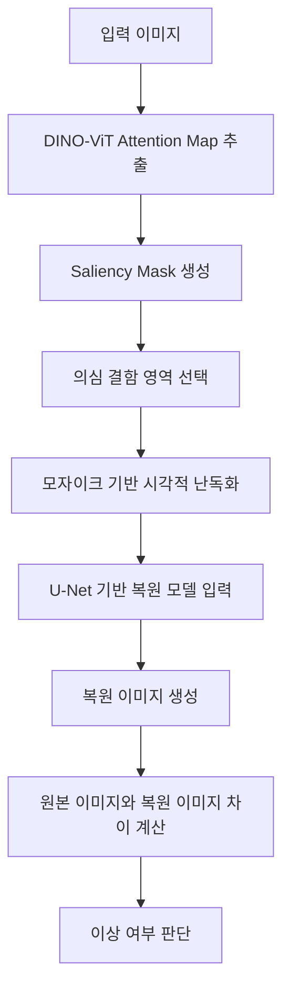

# 관련 논문 정리: 시각적 결함 난독화 기반 자기지도 이상탐지

> Park, Y., Kang, S., Kim, M. J. et al.
> *Visual defect obfuscation based self-supervised anomaly detection.*
> Scientific Reports, 14, 18872, 2024.
> DOI: https://doi.org/10.1038/s41598-024-69698-5

---

## 1. 논문 기본 정보

| 항목           | 내용                                                                                              |
| ------------ | ----------------------------------------------------------------------------------------------- |
| 논문 제목        | Visual defect obfuscation based self-supervised anomaly detection                               |
| 번역 제목        | 시각적 결함 난독화 기반 자기지도 이상탐지                                                                         |
| 학술지          | Scientific Reports                                                                              |
| 출판 연도        | 2024                                                                                            |
| 연구 분야        | 컴퓨터 비전, 이상탐지, 자기지도학습, 산업용 결함 탐지                                                                 |
| 제안 방법        | EAR: Excision And Recovery                                                                      |
| 주요 기술        | DINO-ViT, Attention Map, Saliency Mask, Mosaic Obfuscation, U-Net, Reconstruction-by-Inpainting |
| 사용 데이터셋      | MVTec AD, KolektorSDD2                                                                          |
| 평가 지표        | AUROC                                                                                           |
| 본 프로젝트와의 관련성 | 영상 마스킹, 영역 탐지, 시각 정보 난독화, 경량화된 영상 처리 전략                                                         |

---

## 2. 논문 선정 이유

본 논문은 제조업 제품 이미지의 결함 탐지를 대상으로 하지만, 본 프로젝트의 주제인 **IP 카메라 영상 유출 방지를 위한 보안 게이트웨이 및 영상 마스킹 처리**와 연결되는 부분이 많다.

특히 이 논문은 영상 또는 이미지에서 특정 영역을 탐지한 뒤, 해당 영역을 **마스킹, 모자이크, 난독화**하여 모델이 정상 패턴과 비정상 패턴을 구분하도록 만드는 방법을 제안한다. 본 프로젝트 역시 IP 카메라 영상에서 사람 또는 민감 정보 영역을 탐지하고, 해당 영역을 마스킹 처리하여 원본 영상 유출 위험을 줄이는 것을 목표로 한다.

| 논문 내용                        | 본 프로젝트와의 연결점                |
| ---------------------------- | --------------------------- |
| 의심 결함 영역 탐지                  | 영상 내 보호 대상 영역 탐지            |
| Saliency Mask 생성             | 사람 또는 민감 영역 마스크 생성          |
| Mosaic Obfuscation 적용        | 비인가 접속 시 모자이크 또는 블러 처리      |
| Reconstruction-by-Inpainting | 영상 영역 복원 및 차이 기반 평가 아이디어    |
| 실시간성과 출력 안정성 고려              | Raspberry Pi 환경에서 경량 처리 필요성 |
| AUROC 기반 정량 평가               | 마스킹 처리율, 누출률, 성공률 기반 정량 평가  |

따라서 이 논문은 본 프로젝트에서 **영상 마스킹 방식의 근거**, **마스킹 영역 선정 방식**, **실시간 처리 최적화 방향**, **정량 평가의 필요성**을 설명하는 관련 연구로 활용할 수 있다.

---

## 3. 연구 배경

제조업에서는 제품 품질 검사를 자동화하기 위해 머신비전 시스템이 널리 사용된다. 그러나 실제 제조 초기 단계에서는 불량 제품 이미지가 충분히 확보되지 않는 경우가 많다. 이로 인해 정상 이미지와 불량 이미지를 모두 활용하는 완전지도학습 방식은 적용하기 어렵다.

이 문제를 해결하기 위해 비지도 이상탐지 또는 자기지도 이상탐지 방식이 활용된다. 이 방식은 주로 정상 샘플만을 학습에 사용하고, 테스트 단계에서 정상 패턴과 다르게 나타나는 영역을 이상으로 판단한다.

기존의 재구성 기반 이상탐지 방법은 모델이 정상 이미지는 잘 복원하지만, 학습하지 못한 이상 패턴은 정확히 복원하지 못한다는 가정에 기반한다. 그러나 기존 방식에는 다음과 같은 한계가 있었다.

| 기존 방식의 문제점      | 설명                                        |
| --------------- | ----------------------------------------- |
| 추론 시간 증가        | 여러 번 마스킹하거나 점진적으로 복원하는 방식은 처리 시간이 오래 걸림   |
| 출력 불안정성         | 랜덤 마스킹을 사용할 경우 실행할 때마다 결과가 달라질 수 있음       |
| 큰 마스킹 영역의 복원 실패 | 넓은 영역을 완전히 비우면 정상 패턴 복원에 필요한 정보가 부족해짐     |
| 실제 산업 적용의 어려움   | 처리 시간이 길거나 결과가 불안정하면 실시간 검사 시스템에 적용하기 어려움 |

본 논문은 이러한 문제를 해결하기 위해 **결정적 단일 마스킹**과 **모자이크 기반 시각적 난독화 힌트**를 결합한 EAR 방법을 제안하였다.

---

## 4. 연구 목적

이 논문의 주요 목적은 정상 샘플만을 이용하는 비지도 이상탐지 환경에서 더 빠르고 안정적인 결함 탐지 방법을 제안하는 것이다.

구체적인 목적은 다음과 같다.

| 구분   | 내용                                              |
| ---- | ----------------------------------------------- |
| 목적 1 | 결함 의심 영역을 효과적으로 선택하는 마스킹 전략을 제안한다.              |
| 목적 2 | 랜덤 마스킹의 출력 불안정성 문제를 줄인다.                        |
| 목적 3 | 여러 번 마스킹하는 방식보다 빠른 단일 마스킹 방식을 구현한다.             |
| 목적 4 | 마스킹 영역을 완전히 비우는 대신 모자이크 힌트를 제공하여 정상 패턴 복원을 돕는다. |
| 목적 5 | 기존 신경망 구조를 크게 변경하지 않고 이상탐지 성능을 향상시킨다.           |

---

## 5. 핵심 개념 정리

### 5.1 비지도 이상탐지

비지도 이상탐지는 이상 데이터가 충분하지 않은 상황에서 정상 데이터만을 이용해 모델을 학습하고, 이후 정상과 다른 패턴을 이상으로 판단하는 방법이다.

본 논문에서는 제조업 결함 데이터가 부족한 상황을 가정하고, 정상 제품 이미지만을 사용하여 이상탐지 모델을 학습한다.

### 5.2 Reconstruction-by-Inpainting

Reconstruction-by-Inpainting은 이미지의 일부 영역을 가린 뒤, 모델이 해당 영역을 다시 복원하도록 학습하는 방식이다.

정상 이미지의 경우 모델이 가려진 영역을 비교적 정확하게 복원할 수 있다. 반면, 테스트 이미지에 결함이 포함되어 있으면 모델은 결함 패턴을 정확히 복원하지 못하고 정상에 가까운 형태로 복원하려고 한다. 이때 원본 이미지와 복원 이미지 사이의 차이를 계산하면 이상 여부를 판단할 수 있다.

### 5.3 Saliency Mask

Saliency Mask는 이미지에서 중요한 영역 또는 주목해야 할 영역을 표시하는 마스크이다. 본 논문에서는 ImageNet으로 사전학습된 DINO-ViT의 attention map을 활용하여 결함이 의심되는 영역을 선택한다.

### 5.4 Visual Obfuscation

Visual Obfuscation은 이미지의 일부 정보를 의도적으로 흐리게 하거나 가려서 원래 정보를 직접적으로 알아보기 어렵게 만드는 방식이다. 본 논문에서는 의심 결함 영역을 완전히 비우는 대신, 해당 영역을 모자이크 처리하여 복원 모델에 제한적인 힌트를 제공한다.

이 방식은 본 프로젝트의 영상 마스킹과도 연결된다. IP 카메라 영상에서 사람 영역을 완전히 제거하는 것보다 모자이크 또는 블러 처리를 적용하면, 민감 정보는 보호하면서도 장면의 전체 맥락은 어느 정도 유지할 수 있다.

---

## 6. 제안 방법: EAR

논문에서 제안한 방법은 **EAR(Excision And Recovery)**이다. EAR은 이름 그대로 의심 영역을 잘라내고, 복원 모델이 해당 영역을 정상 패턴으로 회복하도록 학습하는 방식이다.

EAR의 전체 흐름은 다음과 같다.

---

## 7. EAR의 주요 구성 요소

### 7.1 사전학습 Attention 기반 단일 마스킹

EAR은 ImageNet으로 사전학습된 DINO-ViT 모델을 활용하여 이미지 내 주목 영역을 찾는다. 이 attention 정보를 기반으로 의심 결함 영역을 하나의 saliency mask로 생성한다.

기존의 랜덤 마스킹 방식은 실행할 때마다 마스크 위치가 달라질 수 있다. 반면 EAR은 attention 기반으로 마스크를 결정하기 때문에 같은 입력에 대해 더 일관된 결과를 얻을 수 있다.

| 방식         | 특징                          |
| ---------- | --------------------------- |
| 랜덤 마스킹     | 결과가 매번 달라질 수 있음             |
| 다중 마스킹     | 여러 번 추론해야 하므로 시간이 오래 걸림     |
| 점진적 인페인팅   | 처리 과정이 복잡하고 지연이 발생할 수 있음    |
| EAR 단일 마스킹 | 한 번의 결정적 마스킹으로 속도와 안정성을 확보함 |

### 7.2 모자이크 기반 힌트 제공

기존 방식처럼 마스킹 영역을 완전히 비우면 복원 모델이 정상 패턴을 정확하게 복원하기 어려울 수 있다. 특히 가려진 영역이 넓을수록 이 문제가 커진다.

EAR은 이 문제를 해결하기 위해 가려진 영역을 완전히 제거하지 않고, 모자이크 처리된 정보를 힌트로 제공한다. 이 모자이크 정보는 원본의 세부 정보를 직접적으로 드러내지는 않지만, 복원에 필요한 대략적인 구조나 색상 정보를 제공할 수 있다.

본 프로젝트에서의 시사점은 다음과 같다.

| EAR의 모자이크 힌트      | IP 카메라 프로젝트 적용 방향       |
| ----------------- | ----------------------- |
| 결함 영역을 직접 노출하지 않음 | 사람 또는 민감 영역을 직접 노출하지 않음 |
| 대략적인 시각 정보는 유지    | 장면 이해에 필요한 최소 정보 유지     |
| 복원 성능 향상          | 영상 사용성과 보호 성능의 균형 고려    |
| 마스킹 영역의 정보량 조절    | 블러 강도 또는 모자이크 크기 조정 가능  |

### 7.3 모자이크 크기 추정

논문에서는 모자이크 크기가 성능에 영향을 미친다고 설명한다. 너무 작은 모자이크는 원본 정보가 많이 남아 있을 수 있고, 너무 큰 모자이크는 복원에 필요한 힌트가 부족할 수 있다.

이를 해결하기 위해 논문은 이미지의 시각적 특성에 따라 적절한 모자이크 크기를 추정하는 방법을 사용한다. 세밀한 패턴이 많은 제품은 비교적 작은 모자이크 크기가 필요하고, 표면이 단순한 제품은 더 큰 모자이크 크기가 효과적일 수 있다.

이 부분은 본 프로젝트에서도 활용할 수 있다. 예를 들어 IP 카메라 영상에서 사람의 얼굴, 전신, 배경, 소지품 등 보호 대상의 종류에 따라 블러 강도나 모자이크 크기를 다르게 설정할 수 있다.

---

## 8. 실험 방법

논문은 제안 방법의 성능을 평가하기 위해 공개 산업용 결함 탐지 데이터셋을 사용하였다.

| 데이터셋         | 설명                               |
| ------------ | -------------------------------- |
| MVTec AD     | 산업용 비지도 이상탐지 평가에 널리 사용되는 공개 데이터셋 |
| KolektorSDD2 | 표면 결함 탐지에 사용되는 공개 데이터셋           |

MVTec AD 데이터셋은 10개의 객체 범주와 5개의 텍스처 범주로 구성되어 있으며, 학습 데이터에는 정상 샘플만 포함되고 테스트 데이터에는 정상 샘플과 결함 샘플이 함께 포함된다.

논문에서 사용한 주요 평가 지표는 **AUROC**이다. AUROC는 정상 샘플과 이상 샘플을 얼마나 잘 구분하는지 평가하는 지표로, 값이 1에 가까울수록 이상탐지 성능이 우수하다고 볼 수 있다.

---

## 9. 주요 결과

논문은 EAR이 기존 reconstruction-by-inpainting 기반 이상탐지 방법보다 처리 속도와 출력 안정성 측면에서 장점을 보였다고 설명한다. 또한 모자이크 기반 시각적 난독화 힌트가 정상 패턴의 복원 성능을 높이고, 이상 패턴에 대해서는 큰 복원 오류가 발생하도록 도와 이상탐지 성능을 향상시켰다고 보고한다.

주요 결과는 다음과 같이 정리할 수 있다.

| 항목                 | 결과 요약                               |
| ------------------ | ----------------------------------- |
| 단일 결정적 마스킹         | 여러 번 마스킹하는 기존 방식보다 추론 시간을 줄임        |
| Attention 기반 영역 선택 | 의심 결함 영역을 더 안정적으로 선택함               |
| 모자이크 힌트 제공         | 마스킹 영역을 완전히 비우는 방식보다 복원 성능을 높임      |
| 기존 모델 구조 유지        | 신경망 구조를 크게 바꾸지 않고 성능을 향상시킴          |
| 공개 데이터셋 평가         | MVTec AD와 KolektorSDD2에서 유망한 결과를 보임 |

---

## 10. 본 프로젝트와의 관련성

본 논문은 제조업 결함 탐지를 위한 이상탐지 연구이지만, 본 프로젝트의 영상 마스킹 처리와 다음과 같은 관련성이 있다.

### 10.1 마스킹 영역을 어떻게 정할 것인가

본 프로젝트에서는 IP 카메라 영상에서 사람 또는 민감 정보 영역을 찾아 마스킹해야 한다. 이 논문은 attention 기반으로 중요한 영역을 선택하는 방법을 제시한다.

현재 본 프로젝트는 YOLO 기반 객체 탐지를 활용하고 있지만, 향후에는 attention 기반 saliency map이나 segmentation 기법을 함께 활용하여 보호 대상 영역을 더 정교하게 선택할 수 있다.

| 논문                               | 본 프로젝트                          |
| -------------------------------- | ------------------------------- |
| DINO-ViT attention으로 결함 의심 영역 선택 | YOLO 또는 segmentation으로 사람 영역 탐지 |
| Saliency Mask 생성                 | 보호 대상 마스크 생성                    |
| 결함 영역 중심 마스킹                     | 개인정보 영역 중심 마스킹                  |

### 10.2 마스킹은 단순 가림이 아니라 정보량 조절이다

논문은 마스킹 영역을 완전히 비우는 것보다 모자이크를 통해 제한적인 시각 정보를 남기는 것이 성능에 도움이 된다고 설명한다.

본 프로젝트에서도 모든 영역을 단순히 검은색으로 가리는 방식보다, 모자이크 또는 블러를 사용하면 영상의 사용성을 유지하면서 개인정보를 보호할 수 있다.

| 마스킹 방식        | 장점                  | 단점                  |
| ------------- | ------------------- | ------------------- |
| 검은 박스 처리      | 정보 노출이 적음           | 영상 맥락 파악이 어려움       |
| 블러 처리         | 자연스러운 비식별화 가능       | 강도가 약하면 정보가 남을 수 있음 |
| 모자이크 처리       | 정보 보호와 장면 이해의 균형 가능 | 모자이크 크기 설정이 중요      |
| 바운딩 박스 전체 마스킹 | 누출 위험 감소            | 과잉 마스킹 가능성 증가       |

### 10.3 실시간 처리를 고려해야 한다

논문은 다중 마스킹이나 점진적 인페인팅 방식이 추론 지연을 발생시킨다고 지적한다. 이를 해결하기 위해 단일 결정적 마스킹 전략을 제안하였다.

본 프로젝트에서도 Raspberry Pi의 연산 성능이 제한적이기 때문에, 실시간 마스킹을 위해서는 탐지 횟수, 해상도, 모델 크기, 마스킹 방식 등을 최적화해야 한다.

적용 가능한 개선 방향은 다음과 같다.

* 매 프레임마다 무거운 모델을 실행하지 않고 일정 프레임 간격으로 탐지
* 탐지된 바운딩 박스를 다음 프레임에 일정 시간 재사용
* 세그멘테이션보다 바운딩 박스 기반 전체 마스킹을 우선 적용
* 모자이크 크기와 블러 강도를 상황에 따라 조절
* Raspberry Pi 환경에서 FPS를 함께 측정

### 10.4 출력 안정성이 중요하다

랜덤 마스킹은 결과가 불안정할 수 있다. IP 카메라 보안에서도 마스킹 결과가 프레임마다 흔들리거나, 어떤 프레임에서는 마스킹되고 어떤 프레임에서는 누락되면 원본 정보가 노출될 수 있다.

따라서 본 프로젝트에서도 다음과 같은 안정화 전략이 필요하다.

* 탐지 영역을 일정 비율로 확장
* 이전 프레임의 탐지 결과를 활용
* 객체 추적 알고리즘 적용
* 바운딩 박스 전체 마스킹 적용
* 마스킹 누락률을 정량 평가

---

## 11. 본 프로젝트에 적용할 수 있는 점

이 논문을 바탕으로 본 프로젝트에 적용할 수 있는 점은 다음과 같다.

| 적용 가능 요소   | 본 프로젝트 적용 방향                          |
| ---------- | ------------------------------------- |
| 결정적 마스킹 전략 | 매번 결과가 달라지지 않도록 안정적인 탐지 및 마스킹 로직 설계   |
| 시각적 난독화    | 비인가 접속 시 블러 또는 모자이크 영상 제공             |
| 모자이크 크기 조절 | 보호 대상 크기와 영상 해상도에 따라 모자이크 강도 조절       |
| 영역 기반 처리   | 사람, 얼굴, 민감 객체 등 특정 영역 중심으로 마스킹        |
| 실시간성 고려    | Raspberry Pi 환경에서 처리 속도와 마스킹 품질 균형 확보 |
| 정량 평가      | 마스킹 처리율, 누출률, 과잉 마스킹률로 성능 평가          |

---

## 12. 한계점 및 비판적 검토

이 논문은 본 프로젝트에 유용한 시사점을 제공하지만, 직접적으로 IP 카메라 보안을 다룬 연구는 아니다. 따라서 다음과 같은 한계가 있다.

| 한계점            | 설명                                                |
| -------------- | ------------------------------------------------- |
| 연구 대상 차이       | 논문은 제조업 제품 이미지의 결함 탐지를 다루고, 본 프로젝트는 IP 카메라 영상을 다룸 |
| 보안 게이트웨이 미포함   | 논문은 네트워크 보안 구조나 게이트웨이를 직접 다루지 않음                  |
| 개인정보 보호 목적과 차이 | 논문은 결함 탐지가 목적이고, 본 프로젝트는 사생활 보호가 목적임              |
| 실시간 스트리밍 환경 차이 | 논문은 이미지 기반 평가이며, 본 프로젝트는 영상 스트림 처리가 필요함           |
| 평가 지표 차이       | 논문은 AUROC를 사용하고, 본 프로젝트는 마스킹 처리율과 누출률을 사용함        |

따라서 이 논문은 IP 카메라 보안의 직접 선행연구라기보다는, **영상 내 특정 영역을 탐지하고 마스킹 또는 난독화하는 방법론적 근거**로 활용하는 것이 적절하다.

---

## 13. 논문에서 가져올 수 있는 문장 방향

본 프로젝트의 관련 연구 부분에서는 다음과 같이 활용할 수 있다.

> Park 등은 산업용 이미지 결함 탐지를 위해 시각적 결함 난독화 기반 자기지도 이상탐지 방법인 EAR을 제안하였다. 해당 연구는 사전학습된 DINO-ViT의 attention 정보를 활용하여 의심 영역을 결정적으로 선택하고, 해당 영역에 모자이크 기반 시각적 난독화를 적용한 뒤 복원 모델을 통해 이상 여부를 판단한다. 이 연구는 마스킹 영역을 단순히 제거하는 것이 아니라, 모자이크와 같은 난독화 처리를 통해 필요한 시각적 힌트만 남길 수 있음을 보여준다. 이는 본 연구에서 IP 카메라 영상 내 사람 또는 민감 영역을 탐지하고, 비인가 접속 시 블러 또는 모자이크 처리된 영상만 제공하려는 접근과 연결된다.

---

## 14. 본 프로젝트 논문에 넣을 수 있는 관련 연구 정리 문단

다음 문단은 논문 초안의 `2. 관련 연구 및 이론적 배경`에 바로 넣을 수 있는 형태이다.

> 영상 내 특정 영역을 탐지하고 마스킹하는 방식은 이상탐지 및 영상 비식별화 분야에서 중요하게 다루어진다. Park 등은 제조업 제품 이미지의 결함 탐지를 위해 EAR(Excision And Recovery)이라는 자기지도 이상탐지 방법을 제안하였다. 이 방법은 사전학습된 DINO-ViT의 attention 정보를 활용하여 결함이 의심되는 영역을 결정적으로 선택하고, 해당 영역에 모자이크 기반 시각적 난독화를 적용한 뒤 복원 모델을 통해 이상 여부를 판단한다. 특히 랜덤 마스킹으로 인한 출력 불안정성과 다중 마스킹으로 인한 추론 지연 문제를 줄이기 위해 단일 결정적 마스킹 전략을 사용했다는 점에서 실시간 영상 처리 환경에 시사점을 제공한다. 본 연구에서도 IP 카메라 영상 내 보호 대상 영역을 탐지하고 비인가 접속 시 해당 영역을 블러 또는 모자이크 처리하므로, 해당 연구는 영상 마스킹 영역 설정과 난독화 강도 조절의 방법론적 근거로 활용될 수 있다.

---

## 15. 최종 정리

이 논문은 제조업 이미지에서 결함이 의심되는 영역을 탐지하고, 해당 영역을 모자이크 방식으로 난독화한 뒤 복원 기반 이상탐지를 수행하는 연구이다. 핵심은 **어떤 영역을 마스킹할 것인지**, **마스킹 영역에 어느 정도 정보를 남길 것인지**, **실시간 처리를 위해 어떻게 계산량을 줄일 것인지**에 있다.

본 프로젝트에서는 이 논문을 통해 다음 근거를 확보할 수 있다.

1. 영상 또는 이미지에서 특정 영역을 선택적으로 마스킹하는 방식은 컴퓨터 비전 기반 보호 및 탐지 시스템에서 중요하다.
2. 마스킹은 단순히 가리는 것이 아니라, 정보 보호와 사용성 사이의 균형을 고려해야 한다.
3. 모자이크 크기나 블러 강도는 보호 대상의 크기와 영상 특성에 따라 조절될 수 있다.
4. 실시간 처리 환경에서는 다중 처리보다 단일 결정적 처리 방식이 유리할 수 있다.
5. IP 카메라 영상 보호에서도 마스킹 누락, 과잉 마스킹, 처리 속도 문제를 정량적으로 평가해야 한다.

따라서 본 논문은 IP 카메라 보안 게이트웨이 프로젝트에서 **영상 마스킹 및 난독화 처리의 방법론적 근거**로 활용할 수 있다.
