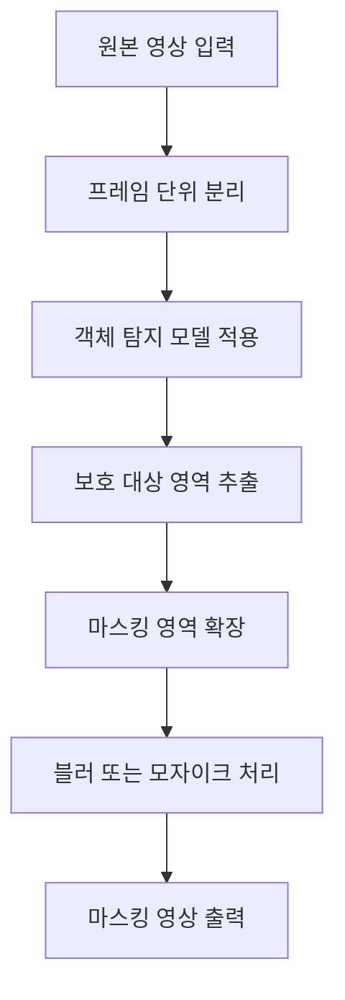
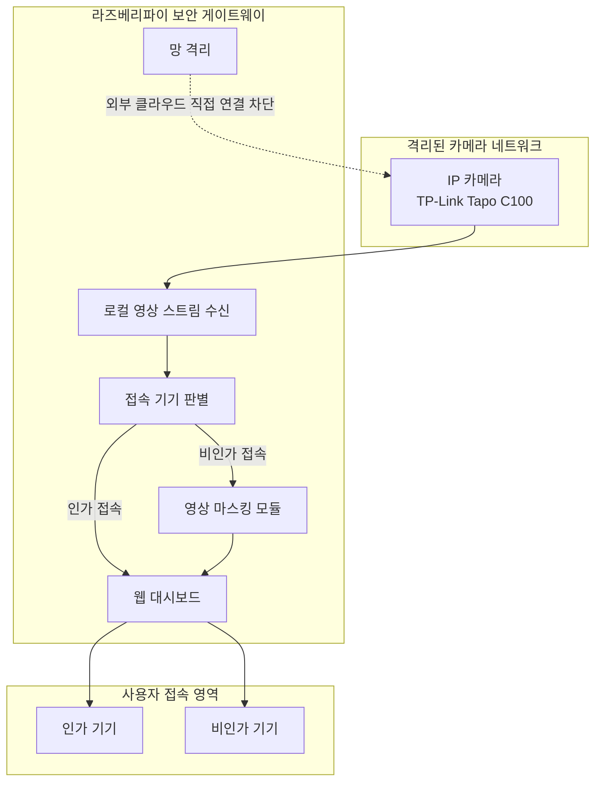
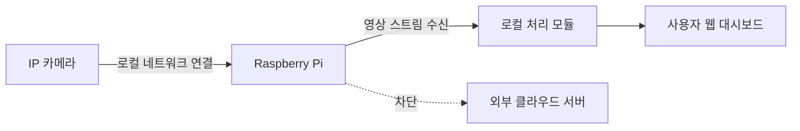
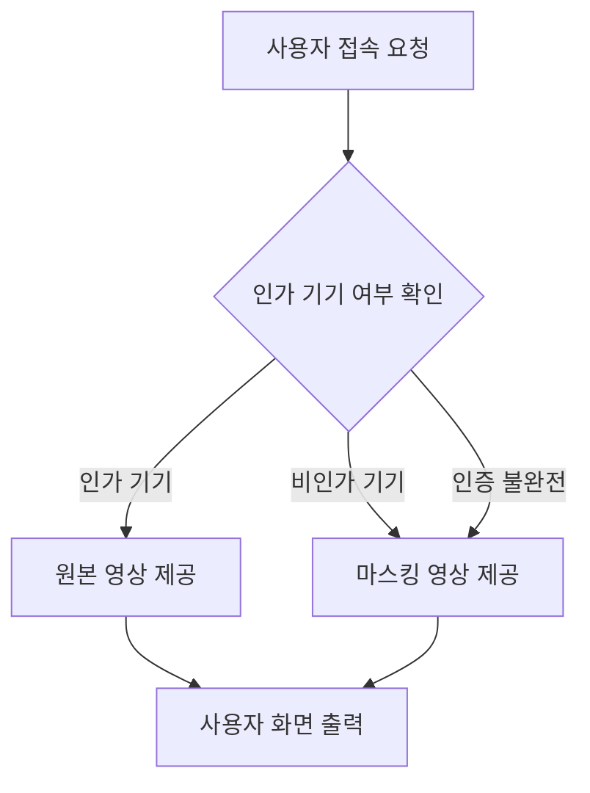
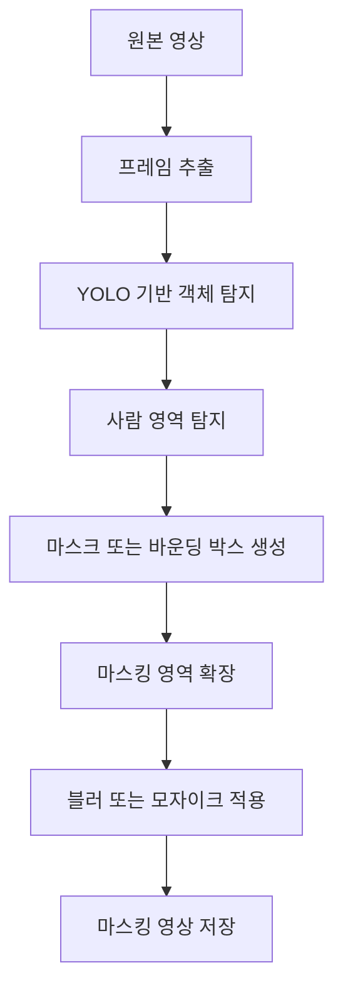
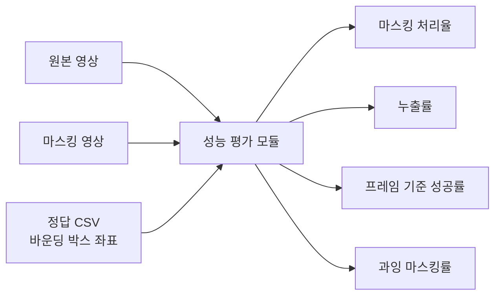
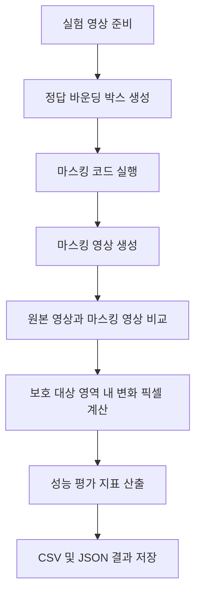
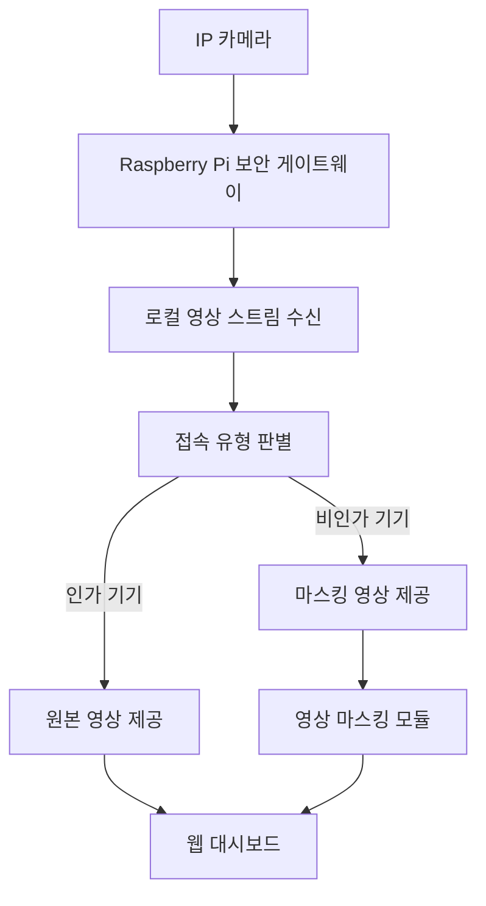

# IP 카메라 영상 유출 방지를 위한 라즈베리파이 기반 보안 게이트웨이 구현 및 마스킹 성능 평가

> 본 문서는 기업연계 프로젝트 결과물 정리를 위한 논문 초안 문서이다.
> GitHub 저장소에서는 `docs/research_draft.md` 파일로 관리하는 것을 권장한다.

---

## 문서 정보

| 항목    | 내용                                     |
| ----- | -------------------------------------- |
| 연구 주제 | IP 카메라 영상 유출 방지를 위한 보안 게이트웨이 구현        |
| 연구 분야 | IoT 보안, 영상 비식별화, 네트워크 보안               |
| 핵심 장비 | Raspberry Pi, TP-Link Tapo C100        |
| 주요 기술 | OpenCV, YOLO, 영상 마스킹, 로컬 게이트웨이         |
| 연구 목적 | IP 카메라 원본 영상 유출 위험을 줄이기 위한 로컬 보안 구조 제안 |
| 문서 상태 | 논문 초안                                  |

---

## 초록

최근 가정용 IP 카메라와 월패드 등 IoT 영상 장비의 보급이 증가하면서, 개인의 사생활 영상이 네트워크를 통해 송수신되는 환경이 일반화되고 있다. 그러나 IP 카메라는 외부 클라우드 서버, 제조사 앱, 계정 인증 방식에 의존하는 경우가 많아, 기기 자체의 취약점이나 서버 침해, 계정 탈취가 발생할 경우 원본 영상이 외부로 유출될 위험이 존재한다.

본 연구는 IP 카메라가 외부 클라우드 서버와 직접 통신하는 구조를 개선하기 위해 Raspberry Pi 기반 보안 게이트웨이를 설계하고, 영상 스트림을 로컬 환경에서 제어하는 방식을 제안한다. 또한 접속 기기의 인가 여부에 따라 원본 영상과 마스킹 영상을 분기 제공하는 투트랙 접속 로직을 적용하여, 비인가 접속 상황에서도 원본 영상이 직접 노출되지 않도록 한다.

영상 마스킹은 객체 탐지 기반으로 수행되며, 원본 영상과 마스킹 영상, 정답 바운딩 박스 정보를 비교하여 마스킹 처리율, 누출률, 프레임 기준 성공률, 과잉 마스킹률 등의 지표로 성능을 평가한다. 본 연구는 IP 카메라 보안을 단순한 비밀번호 관리 문제가 아니라 네트워크 구조와 영상 비식별화 처리를 결합한 방어적 구조로 접근했다는 점에서 의의가 있다.

---

## 주요어

`IP 카메라` `IoT 보안` `보안 게이트웨이` `Raspberry Pi` `영상 마스킹` `객체 탐지` `프라이버시 보호`

---

## 목차

* [1. 서론](#1-서론)

  * [1.1 연구 배경](#11-연구-배경)
  * [1.2 연구 필요성](#12-연구-필요성)
  * [1.3 연구 목적](#13-연구-목적)
  * [1.4 연구 범위](#14-연구-범위)
* [2. 관련 연구 및 이론적 배경](#2-관련-연구-및-이론적-배경)

  * [2.1 IP 카메라 보안 위협](#21-ip-카메라-보안-위협)
  * [2.2 IoT 보안 게이트웨이](#22-iot-보안-게이트웨이)
  * [2.3 영상 비식별화와 마스킹 처리](#23-영상-비식별화와-마스킹-처리)
  * [2.4 객체 탐지 기반 영상 처리](#24-객체-탐지-기반-영상-처리)
* [3. 연구 방법](#3-연구-방법)

  * [3.1 전체 시스템 구성](#31-전체-시스템-구성)
  * [3.2 망 격리 구조 설계](#32-망-격리-구조-설계)
  * [3.3 투트랙 접속 로직](#33-투트랙-접속-로직)
  * [3.4 영상 마스킹 처리 방법](#34-영상-마스킹-처리-방법)
  * [3.5 성능 평가 방법](#35-성능-평가-방법)
* [4. 구현](#4-구현)
* [5. 실험 및 평가](#5-실험-및-평가)
* [6. 실험 결과](#6-실험-결과)
* [7. 논의](#7-논의)
* [8. 결론](#8-결론)
* [참고문헌](#참고문헌)
* [부록](#부록)

---

# 1. 서론

## 1.1 연구 배경

최근 가정용 IP 카메라, 월패드, 홈 IoT 장비의 보급이 증가하면서 개인 주거공간 내부의 영상 정보가 네트워크를 통해 실시간으로 송수신되는 환경이 일반화되고 있다. IP 카메라는 사용자가 외부에서도 실시간 영상을 확인할 수 있다는 장점이 있지만, 동시에 인터넷에 연결된 영상 장비라는 특성상 다양한 보안 위협에 노출될 수 있다.

특히 가정 내부 영상은 거주자의 얼굴, 생활 패턴, 신체 정보, 사생활 공간 등 민감한 정보를 포함한다. 따라서 IP 카메라 영상이 외부로 유출될 경우 단순한 계정 침해를 넘어 심각한 사생활 침해로 이어질 수 있다.

기존의 IP 카메라 보안은 주로 제조사의 클라우드 서버, 공식 앱, 계정 인증 방식에 의존한다. 그러나 제조사의 보안 수준이 충분하지 않거나 기기 자체에 취약점이 존재하는 경우, 사용자는 영상 데이터의 흐름을 직접 통제하기 어렵다. 이러한 한계를 해결하기 위해서는 IP 카메라의 네트워크 구조와 영상 접근 제어 방식을 함께 고려할 필요가 있다.

---

## 1.2 연구 필요성

일반적인 IP 카메라는 외부 서버 또는 제조사 클라우드와 직접 통신하는 구조를 가진다. 이 구조에서는 사용자가 카메라의 네트워크 흐름을 완전히 통제하기 어렵고, 외부 서버 침해나 계정 탈취가 발생할 경우 원본 영상이 그대로 노출될 가능성이 있다.

또한 저가형 IoT 기기의 경우 사후 펌웨어 업데이트가 충분히 제공되지 않거나, 사용자가 보안 설정을 직접 관리하기 어려운 경우가 많다. 따라서 기기 자체의 보안성이나 제조사의 관리 능력에만 의존하는 방식은 한계가 있다.

본 연구에서는 IP 카메라가 외부 인터넷과 직접 통신하지 않도록 망을 분리하고, 모든 영상 스트림을 Raspberry Pi 기반 보안 게이트웨이를 통해 제어하는 구조를 제안한다. 또한 비인가 접속 상황에서 원본 영상이 아닌 마스킹 영상만 제공하도록 하여, 영상이 유출되더라도 개인 식별 정보가 직접 노출되지 않도록 한다.

---

## 1.3 연구 목적

본 연구의 목적은 다음과 같다.

| 구분   | 연구 목적                                           |
| ---- | ----------------------------------------------- |
| 목적 1 | IP 카메라의 외부 클라우드 직접 통신을 차단하는 로컬 네트워크 구조를 설계한다.   |
| 목적 2 | Raspberry Pi 기반 보안 게이트웨이를 통해 영상 스트림을 수신하고 제어한다. |
| 목적 3 | 인가 기기와 비인가 기기를 구분하여 원본 영상과 마스킹 영상을 분기 제공한다.     |
| 목적 4 | 객체 탐지 기반 영상 마스킹 처리 파이프라인을 구현한다.                 |
| 목적 5 | 마스킹 처리율, 누출률, 프레임 기준 성공률 등을 활용하여 성능을 평가한다.      |

---

## 1.4 연구 범위

본 연구는 가정용 IP 카메라 환경을 가정하여 Raspberry Pi 기반 보안 게이트웨이 구조를 설계하고, 영상 스트림에 대한 마스킹 처리 및 성능 평가를 수행한다.

연구 범위는 다음과 같다.

* IP 카메라와 Raspberry Pi를 활용한 로컬 네트워크 구조 설계
* IP 카메라의 외부망 통신 차단 구조 검토
* 로컬 영상 스트림 수신 방식 설계
* 인가 기기와 비인가 기기 구분을 위한 접속 로직 설계
* 비인가 접속 시 객체 탐지 기반 영상 마스킹 처리
* 마스킹 처리 결과에 대한 정량적 성능 평가

본 연구는 실제 공격자의 불법 침입 행위를 수행하는 것이 아니라, 보안 게이트웨이 구조와 비식별화 영상 처리 기능을 중심으로 방어적 관점에서 시스템을 구현하고 평가한다.

---

# 2. 관련 연구 및 이론적 배경

## 2.1 IP 카메라 보안 위협

IP 카메라는 네트워크를 통해 영상을 송수신하는 IoT 장비로, 일반적인 폐쇄회로 CCTV와 달리 외부 접속 기능을 제공한다. 이러한 원격 접속 기능은 편의성을 높이지만, 동시에 인증 우회, 취약한 비밀번호, 펌웨어 취약점, 암호화되지 않은 통신, 클라우드 서버 침해 등의 위험을 발생시킬 수 있다.

가정용 IP 카메라의 보안 위협은 다음과 같이 정리할 수 있다.

| 보안 위협    | 설명                                       |
| -------- | ---------------------------------------- |
| 취약한 인증   | 기본 비밀번호, 약한 비밀번호, 계정 탈취 등으로 인한 비인가 접속 위험 |
| 외부 서버 의존 | 제조사 클라우드 서버 침해 시 영상 유출 가능성               |
| 펌웨어 취약점  | 사후 업데이트 부족 또는 알려진 취약점 방치                 |
| 네트워크 노출  | 인터넷에 직접 연결된 장비가 공격 대상이 될 가능성             |
| 원본 영상 유출 | 침해 발생 시 사생활 영상이 그대로 노출될 위험               |

---

## 2.2 IoT 보안 게이트웨이

IoT 보안 게이트웨이는 IoT 기기와 외부 네트워크 사이에서 트래픽을 제어하고, 인증, 필터링, 암호화, 접근 제어 등의 기능을 수행하는 중간 장치이다. 개별 IoT 기기의 보안성이 부족하더라도, 게이트웨이를 활용하면 네트워크 단에서 추가적인 보호 계층을 구성할 수 있다.

본 연구에서는 Raspberry Pi를 보안 게이트웨이로 사용하여 IP 카메라가 외부 인터넷과 직접 통신하지 못하도록 제한하고, 영상 스트림을 로컬 환경에서 수신 및 처리하는 구조를 설계한다.

---

## 2.3 영상 비식별화와 마스킹 처리

영상 비식별화는 영상 속 개인을 식별할 수 있는 얼굴, 신체, 사적 공간, 민감 객체 등을 흐림 처리, 모자이크 처리, 블러 처리, 영역 제거 등의 방식으로 보호하는 기술이다.

IP 카메라 영상에서는 다음과 같은 정보가 보호 대상이 될 수 있다.

* 사람의 얼굴
* 사람의 신체
* 거주 공간 내부 구조
* 개인 소지품
* 생활 패턴을 추정할 수 있는 장면
* 기타 민감 객체

본 연구에서는 객체 탐지 모델을 활용하여 영상 속 사람 영역을 자동으로 탐지하고, 해당 영역에 마스킹 처리를 적용한다. 이를 통해 비인가 접속 상황에서도 원본 영상이 직접 노출되지 않도록 한다.

---

## 2.4 객체 탐지 기반 영상 처리

객체 탐지 기반 영상 처리는 영상 프레임에서 특정 객체의 위치를 탐지한 뒤, 해당 영역에 후처리를 적용하는 방식이다. 본 연구에서는 사람 영역을 탐지하고 해당 영역에 블러 또는 모자이크 처리를 적용하여 민감 정보를 보호한다.

영상 처리 과정은 다음과 같다.



---

# 3. 연구 방법

## 3.1 전체 시스템 구성

본 연구에서 제안하는 시스템은 IP 카메라, Raspberry Pi 보안 게이트웨이, 사용자 접속 기기, 웹 대시보드, 영상 처리 모듈로 구성된다. IP 카메라는 Raspberry Pi에서 구성한 로컬 네트워크에 연결되며, 외부 인터넷과의 직접 통신은 차단된다. 사용자는 Raspberry Pi 보안 게이트웨이를 통해서만 영상에 접근할 수 있다.



시스템 구성 요소는 다음과 같다.

| 구성 요소        | 역할                 |
| ------------ | ------------------ |
| IP 카메라       | 실시간 영상 스트림 생성      |
| Raspberry Pi | 보안 게이트웨이 역할 수행     |
| 방화벽 설정       | 외부 인터넷 직접 통신 차단    |
| 영상 처리 모듈     | 비인가 접속 시 마스킹 처리 수행 |
| 접속 제어 모듈     | 인가 기기와 비인가 기기 구분   |
| 웹 대시보드       | 사용자 영상 확인 인터페이스 제공 |

---

## 3.2 망 격리 구조 설계

본 연구에서는 IP 카메라가 외부 클라우드 서버와 직접 통신하지 못하도록 Raspberry Pi를 중심으로 로컬 네트워크를 구성한다. Raspberry Pi는 무선 AP 또는 중간 게이트웨이 역할을 수행하며, IP 카메라의 트래픽은 Raspberry Pi를 통해서만 전달된다.

망 격리 구조의 핵심은 다음과 같다.

1. IP 카메라를 Raspberry Pi 내부망에 연결한다.
2. IP 카메라의 외부망 직접 통신을 차단한다.
3. Raspberry Pi에서 로컬 영상 스트림을 수신한다.
4. 사용자는 Raspberry Pi 웹 대시보드를 통해서만 영상에 접근한다.



이 구조를 통해 제조사 클라우드 서버에 대한 의존도를 낮추고, 사용자가 직접 통제 가능한 로컬 보안 구조를 구성한다.

---

## 3.3 투트랙 접속 로직

본 연구에서는 접속 기기의 인가 여부에 따라 서로 다른 영상 스트림을 제공하는 투트랙 접속 로직을 설계한다. 인가 기기가 접속한 경우에는 사용자 본인의 기기라고 판단하여 원본 영상을 제공한다. 반면, 비인가 기기 또는 신뢰할 수 없는 접속 환경에서는 원본 영상을 제공하지 않고 마스킹 처리된 영상만 제공한다.



접속 유형별 처리 방식은 다음과 같다.

| 접속 유형  | 제공 영상  | 처리 기준               |
| ------ | ------ | ------------------- |
| 인가 기기  | 원본 영상  | 사전에 등록된 사용자 기기      |
| 비인가 기기 | 마스킹 영상 | 등록되지 않은 기기 또는 외부 접속 |
| 인증 불완전 | 마스킹 영상 | 원본 노출 방지 우선 원칙 적용   |

이 방식은 공격자가 계정 정보 일부를 획득하더라도 원본 영상 접근을 제한할 수 있다는 장점이 있다.

---

## 3.4 영상 마스킹 처리 방법

영상 마스킹 처리는 입력 영상에서 사람 또는 민감 객체 영역을 탐지한 뒤, 해당 영역에 블러 또는 모자이크 처리를 적용하는 방식으로 수행한다.

처리 절차는 다음과 같다.

| 단계 | 내용                               |
| -: | -------------------------------- |
|  1 | 원본 영상 파일 또는 실시간 스트림 입력           |
|  2 | 프레임 단위로 영상 분리                    |
|  3 | 객체 탐지 모델을 이용하여 사람 영역 탐지          |
|  4 | 탐지된 영역을 바운딩 박스 또는 세그멘테이션 마스크로 변환 |
|  5 | 탐지 영역을 일정 비율로 확장                 |
|  6 | 확장된 영역 전체에 블러 또는 모자이크 적용         |
|  7 | 마스킹 처리된 프레임 저장                   |
|  8 | 전체 프레임을 결합하여 출력 영상 생성            |



---

## 3.5 성능 평가 방법

본 연구에서는 마스킹 처리 결과를 정량적으로 평가하기 위해 원본 영상, 마스킹 영상, 정답 바운딩 박스 정보를 비교한다. 정답 바운딩 박스는 보호되어야 할 대상 영역을 의미하며, 마스킹 영상에서 실제로 변화가 발생한 영역과 비교하여 마스킹 처리율을 산출한다.



### 3.5.1 마스킹 처리율

마스킹 처리율은 보호 대상 영역 중 실제로 마스킹 처리된 픽셀의 비율을 의미한다.

```text
마스킹 처리율 = 실제 마스킹된 보호 대상 픽셀 수 / 전체 보호 대상 픽셀 수 × 100
```

### 3.5.2 누출률

누출률은 보호 대상 영역 중 마스킹되지 않고 남아 있는 픽셀의 비율을 의미한다.

```text
누출률 = 100 - 마스킹 처리율
```

### 3.5.3 프레임 기준 성공률

프레임 기준 성공률은 각 프레임에서 마스킹 처리율이 기준값 이상인 경우를 성공으로 판단하고, 전체 평가 프레임 중 성공한 프레임의 비율을 계산한 값이다.

```text
프레임 기준 성공률 = 성공 프레임 수 / 전체 평가 프레임 수 × 100
```

### 3.5.4 과잉 마스킹률

과잉 마스킹률은 보호 대상이 아닌 영역이 불필요하게 마스킹된 정도를 의미한다. 과잉 마스킹률이 지나치게 높으면 영상의 사용성이 저하될 수 있으므로, 보안성과 사용성의 균형을 함께 고려해야 한다.

---

# 4. 구현

## 4.1 개발 환경

본 연구의 구현 환경은 다음과 같다.

| 구분       | 내용                              |
| -------- | ------------------------------- |
| 하드웨어     | Raspberry Pi, TP-Link Tapo C100 |
| 운영체제     | Raspberry Pi OS                 |
| 프로그래밍 언어 | Python                          |
| 주요 라이브러리 | OpenCV, NumPy, Pandas           |
| 객체 탐지 모델 | YOLO 기반 모델                      |
| 영상 입력    | CCTV 유사 영상 데이터 또는 IP 카메라 스트림    |
| 출력 결과    | 마스킹 영상, 평가 CSV, 요약 JSON         |

---

## 4.2 라즈베리파이 기반 게이트웨이 구현

Raspberry Pi는 IP 카메라와 사용자 접속 기기 사이에서 중간 게이트웨이 역할을 수행한다. IP 카메라는 Raspberry Pi 내부망에 연결되며, Raspberry Pi는 방화벽 설정을 통해 IP 카메라의 외부 인터넷 직접 접속을 제한한다.

게이트웨이 구현의 주요 기능은 다음과 같다.

* IP 카메라 로컬 네트워크 연결
* 외부망 트래픽 차단
* 영상 스트림 수신
* 접속 기기 판별
* 원본 영상 또는 마스킹 영상 분기 제공

---

## 4.3 영상 처리 모듈 구현

영상 처리 모듈은 OpenCV를 활용하여 입력 영상을 프레임 단위로 처리한다. 객체 탐지 모델을 통해 사람 영역을 탐지하고, 탐지된 영역에 블러 처리를 적용한다. 처리된 프레임은 다시 영상 파일로 저장되며, 필요 시 웹 대시보드에서 실시간으로 출력할 수 있다.

영상 처리 모듈의 핵심 기능은 다음과 같다.

* 원본 영상 불러오기
* 프레임별 객체 탐지
* 보호 대상 영역 추출
* 탐지 영역 확장
* 블러 또는 모자이크 적용
* 결과 영상 저장

---

## 4.4 성능 평가 모듈 구현

성능 평가 모듈은 원본 영상과 마스킹 영상의 차이를 비교하여 실제로 마스킹이 적용된 영역을 계산한다. 이후 정답 바운딩 박스와 비교하여 마스킹 처리율, 프레임 기준 성공률, 누출률 등을 산출한다.

평가 결과는 CSV와 JSON 파일로 저장하여 이후 분석 및 보고서 작성에 활용한다.

성능 평가 모듈의 입력과 출력은 다음과 같다.

| 구분   | 내용            |
| ---- | ------------- |
| 입력 1 | 원본 영상         |
| 입력 2 | 마스킹 영상        |
| 입력 3 | 정답 바운딩 박스 CSV |
| 출력 1 | 프레임별 평가 CSV   |
| 출력 2 | 요약 평가 JSON    |
| 출력 3 | 평가 미리보기 영상    |

---

# 5. 실험 및 평가

## 5.1 실험 목적

본 실험의 목적은 제안한 영상 마스킹 처리 방식이 보호 대상 영역을 얼마나 효과적으로 비식별화하는지 확인하는 것이다. 또한 Raspberry Pi와 같은 제한된 연산 환경에서 적용 가능한 경량 영상 처리 방식의 가능성을 평가한다.

---

## 5.2 실험 데이터

본 연구에서는 가정용 IP 카메라와 유사한 환경을 가정할 수 있는 CCTV 또는 실내 영상 데이터를 사용한다. 영상 내 사람 영역 또는 보호 대상 영역을 기준으로 정답 바운딩 박스를 생성하고, 이를 성능 평가 기준으로 활용한다.

실험 데이터 구성은 다음과 같다.

| 항목     | 내용                         |
| ------ | -------------------------- |
| 입력 영상  | CCTV 유사 영상 또는 IP 카메라 촬영 영상 |
| 정답 데이터 | 프레임별 바운딩 박스 좌표             |
| 평가 대상  | 사람 또는 민감 정보 영역             |
| 출력 결과  | 마스킹 영상, 평가 결과 CSV, 요약 JSON |

---

## 5.3 실험 절차



실험 절차는 다음과 같다.

1. 원본 영상 데이터를 준비한다.
2. 보호 대상 영역에 대한 정답 바운딩 박스를 작성한다.
3. 객체 탐지 기반 마스킹 코드를 실행한다.
4. 마스킹 처리된 영상을 생성한다.
5. 원본 영상과 마스킹 영상을 비교한다.
6. 정답 바운딩 박스 영역 내 변화 픽셀을 계산한다.
7. 마스킹 처리율, 누출률, 프레임 기준 성공률을 산출한다.
8. 결과를 표와 그래프로 정리한다.

---

## 5.4 평가 기준

본 연구에서는 다음 기준을 중심으로 성능을 평가한다.

| 평가 지표      | 의미                        | 해석          |
| ---------- | ------------------------- | ----------- |
| 마스킹 처리율    | 보호 대상 영역 중 실제로 마스킹된 비율    | 높을수록 좋음     |
| 누출률        | 보호 대상 영역 중 마스킹되지 않은 비율    | 낮을수록 좋음     |
| 프레임 기준 성공률 | 기준 처리율 이상을 달성한 프레임 비율     | 높을수록 좋음     |
| 과잉 마스킹률    | 보호 대상 외 영역이 불필요하게 마스킹된 비율 | 과도하면 사용성 저하 |
| 처리 속도      | 영상 처리 과정에서의 프레임 처리 성능     | 실시간성 판단 기준  |

---

# 6. 실험 결과

## 6.1 마스킹 처리 결과

본 연구에서 구현한 영상 마스킹 모듈을 적용한 결과, 영상 내 탐지된 사람 영역에 대해 블러 또는 모자이크 처리가 수행되었다. 마스킹 결과는 원본 영상과 비교하여 보호 대상 영역이 비식별화되었는지를 중심으로 확인하였다.

아래 표는 실험 결과를 정리하기 위한 양식이다.

| 실험 영상   | 평가 프레임 수 | 마스킹 처리율 | 누출률 | 프레임 기준 성공률 | 과잉 마스킹률 |
| ------- | -------: | ------: | --: | ---------: | ------: |
| Video 1 |        - |       - |   - |          - |       - |
| Video 2 |        - |       - |   - |          - |       - |
| Video 3 |        - |       - |   - |          - |       - |

---

## 6.2 평가 결과 분석

실험 결과에서 마스킹 처리율이 높게 나타난 경우, 보호 대상 영역이 효과적으로 비식별화되었음을 의미한다. 반대로 누출률이 높게 나타난 경우에는 객체 탐지 실패, 마스크 영역 부족, 프레임 간 객체 이동, 낮은 해상도, 조명 변화 등의 요인이 영향을 미쳤을 가능성이 있다.

프레임 기준 성공률은 전체 영상에서 안정적으로 마스킹이 수행되었는지를 보여준다. 특정 프레임에서 성공률이 낮게 나타나는 경우, 탐지 모델의 성능 개선, 바운딩 박스 기반 전체 마스킹, 마스크 영역 확장, 신뢰도 기준 조정 등의 보완이 필요하다.

---

## 6.3 문제점 및 개선 방향

실험 과정에서 발생할 수 있는 주요 문제점은 다음과 같다.

| 문제점         | 원인                     | 개선 방향                   |
| ----------- | ---------------------- | ----------------------- |
| 마스킹 누락      | 객체 탐지 실패               | 탐지 모델 개선, confidence 조정 |
| 마스크 영역 부족   | 세그멘테이션 영역이 실제 객체보다 작음  | 바운딩 박스 전체 마스킹 또는 마스크 확장 |
| 프레임 간 위치 오차 | 이전 프레임 마스크 재사용         | 탐지 주기 조정, 추적 알고리즘 적용    |
| 처리 속도 저하    | Raspberry Pi의 연산 성능 한계 | 경량 모델 적용, 해상도 조정        |
| 과잉 마스킹      | 마스크 확장 영역 과다           | 확장 비율 조정                |

---

# 7. 논의

본 연구는 IP 카메라 보안 문제를 단순히 계정 관리나 비밀번호 변경의 문제로 보지 않고, 네트워크 구조와 영상 비식별화 처리를 결합하여 해결하고자 하였다는 점에서 의의가 있다. 특히 보안 게이트웨이를 통해 IP 카메라의 외부 직접 통신을 차단하고, 비인가 접속 시 마스킹 영상만 제공하는 구조는 원본 영상 유출 가능성을 줄이는 데 기여할 수 있다.

또한 영상 마스킹 기능은 침해 사고가 발생하더라도 영상 내 민감 정보가 직접 노출되지 않도록 하는 보조적 방어 수단으로 활용될 수 있다. 이는 기존의 인증 중심 보안 방식에 비해, 영상 데이터 자체의 노출 위험을 줄이는 방향으로 보안 계층을 추가한다는 장점이 있다.

다만 본 연구는 프로토타입 수준의 구현이므로 실제 가정 환경에서 장기간 안정적으로 동작하는지에 대한 추가 검증이 필요하다. 또한 객체 탐지 기반 마스킹은 탐지 모델의 성능에 따라 결과가 달라질 수 있으므로, 다양한 영상 환경과 조명 조건, 사람의 자세, 거리, 움직임에 대한 추가 실험이 요구된다.

---

# 8. 결론

본 연구에서는 가정용 IP 카메라 영상 유출 문제를 해결하기 위해 Raspberry Pi 기반 보안 게이트웨이 구조와 객체 탐지 기반 영상 마스킹 방식을 제안하였다. 제안 시스템은 IP 카메라의 외부 직접 통신을 차단하고, 사용자가 제어 가능한 로컬 게이트웨이를 통해 영상 스트림을 관리하도록 설계되었다.

또한 인가 기기와 비인가 기기를 구분하여 비인가 접속 시 원본 영상이 아닌 마스킹 영상만 제공함으로써 영상 유출 피해를 줄이고자 하였다. 실험에서는 원본 영상과 마스킹 영상, 정답 바운딩 박스를 비교하여 마스킹 처리율과 누출률을 평가하였다.

향후 연구에서는 Raspberry Pi 환경에서의 실시간 처리 성능을 개선하고, 다양한 IP 카메라 및 실제 가정 환경에서의 적용 가능성을 검증할 필요가 있다. 또한 인증 로직, 웹 대시보드 보안, 장시간 스트리밍 안정성 등을 보완하여 실제 사용 가능한 보안 게이트웨이 시스템으로 발전시킬 수 있다.

---

# 참고문헌

> 실제 논문 작성 시 아래 항목은 반드시 실제 참고문헌으로 교체해야 한다.

|  번호 | 참고문헌                       |
| --: | -------------------------- |
| [1] | IP 카메라 보안 취약점 분석 관련 논문     |
| [2] | IoT 보안 게이트웨이 관련 논문         |
| [3] | 영상 비식별화 및 프라이버시 보호 관련 논문   |
| [4] | 객체 탐지 기반 영상 처리 관련 논문       |
| [5] | OpenCV Documentation       |
| [6] | YOLO Documentation         |
| [7] | Raspberry Pi Documentation |

---

# 부록

## 부록 A. 시스템 구성도



---

## 부록 B. 주요 코드 구성

| 파일명             | 역할               |
| --------------- | ---------------- |
| `main.py`       | 전체 실행 흐름 제어      |
| `masking.py`    | 객체 탐지 및 마스킹 처리   |
| `evaluation.py` | 마스킹 성능 평가        |
| `gateway.py`    | 게이트웨이 및 접속 제어 로직 |
| `utils.py`      | 공통 함수 관리         |

---

## 부록 C. 정답 CSV 형식

```csv
frame,x1,y1,x2,y2,label
0,120,80,300,420,person
1,125,82,305,425,person
2,130,85,310,430,person
```

---

## 부록 D. 성능 평가 결과 양식

| 프레임 번호 | 보호 대상 픽셀 수 | 마스킹 픽셀 수 | 마스킹 처리율 | 성공 여부 |
| -----: | ---------: | -------: | ------: | ----- |
|      0 |          - |        - |       - | -     |
|      1 |          - |        - |       - | -     |
|      2 |          - |        - |       - | -     |

---

## 부록 E. 향후 보완 계획

* 실제 IP 카메라 스트림과 코드 연동
* Raspberry Pi 환경에서 실시간 FPS 측정
* 인가 기기 식별 방식 구체화
* 웹 대시보드 로그인 및 세션 관리 강화
* 바운딩 박스 전체 마스킹 방식과 세그멘테이션 마스킹 방식 비교
* 다양한 CCTV 유사 영상 데이터셋을 활용한 성능 검증
